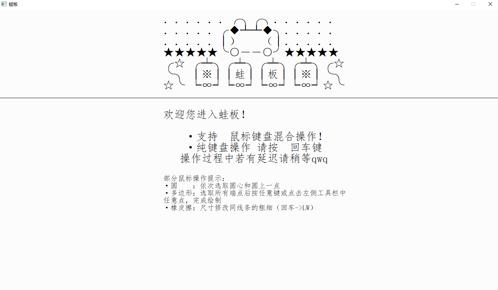
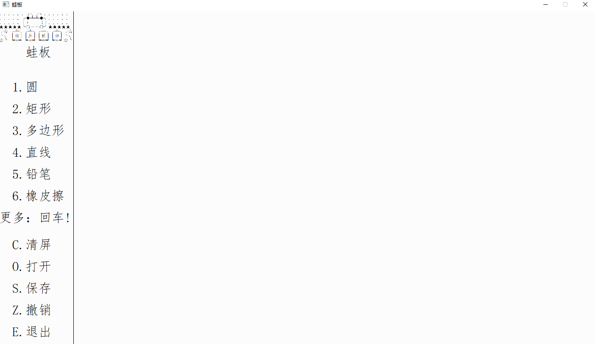

# 蛙板 WaPaint

> 2019-2020学年 秋季学期 《C语言程序设计》 课程设计
>
> 基于 EGE 的画板系统
>
> 2019.09 - 2019.12

## 运行效果

## 编译方式

> 由于指定使用 EGE 作为图形库，你需要前往[官网](https://xege.org/install_and_config)下载对应的运行库才能完成编译。

### Visual Studio

在项目中已经下载并设置了相关的运行库（Visual Studio 2019）：

- `C/C++` - `常规` -  `附加包含目录`： `$(SolutionDir)include`
- `链接器` - `输入` ：` $(SolutionDir)lib\graphics64.lib`

设置完成后，点击编译运行即可。